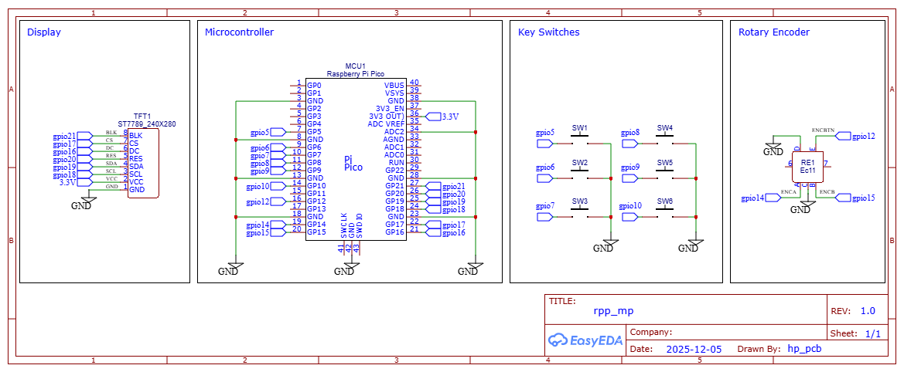
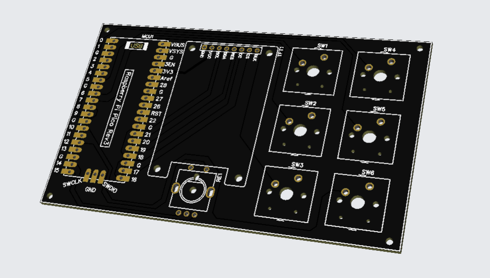

## Custom Macropad with Display

This is a custom **Raspberry Pi Pico based macropad** with a rotary encoder, tft display, 6 keyboard switches. USB communication was done the using TinyUSB.  

---

## Features

- Dual-core processing @ 133 MHz  
  - **Core 0:** Scans keys, handles key presses based on the current **key ID** and **layer ID** adding macro events to a queue 
  - **Core 1:** Updates the display based on the the rotary encoder state and layer  
- **TinyUSB** for HID keyboard functionality over USB  
- Event queue system used for handling actions
- Efficient display updates only updates when encoder state or layer changes  
- PWM controlled display brightness via the encoder button  
- Rotary encoder with interrupts on rising/falling edges to detect layer changes  

---

## Tools and Interfaces Used

| Interface | Purpose |
|-----------|---------|
| **GPIO** | Reading key states, rotary encoder inputs and configuring pull ups |
| **Interrupts** | Handling rotary encoder rotation efficiently |
| **SPI** | Communication with display |
| **PWM** | Controlling display brightness |

---

## Key Architecture

- **Key Handling:**  
  - Each key press generates an action which is added to a queue.  
  - Actions are processed in the main loop and sent over USB.
  - Actions are just function pointers which are stored in a 2d array and can be accessed based on [KEY][LAYER] 

- **Display Management:**  
  - 2D arrays `[KEY_COUNT][LAYER_COUNT]` store pointers to bitmaps, actions, and other related data.  
  - Only updates the screen when encoder state or layer changes.    

- **Rotary Encoder:**  
  - Detects rotation using interrupts on both rising and falling edges.  
  - Encoder button cycles through brightness levels using PWM.  

---

## How It Works

1. Key scanning & actiong handling occurs continuously on Core 0.  
2. Actions are pushed to a queue whenever a key is pressed.  
3. Core 1 monitors the encoder through a global variable and updates the display based on the current layer and encoder state.  
4. USB HID reports are sent over TinyUSB to appear as a standard keyboard.  
5. Display updates are minimized to only the parts that change, conserving CPU cycles.  

---

## Images

**Macropad:**  
  

**Schematic:**  
  

**PCB:**  
 

---

## Tools / Software Used

- **Raspberry Pi Pico SDK / CMake**  
- **TinyUSB** library for USB HID  
- **C** with hardware abstraction for GPIO, PWM, SPI, ADC  
- **VSCode** as development environment  

---
